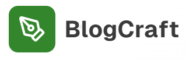

# BlogCraft  

  

  

  
  
  

  

A minimalist and modern blogging application that empowers users to craft blog posts, share them seamlessly across social platforms, and enjoy a clean writing experience.  

---

## 📑 Table of Contents
- [Introduction](#introduction)  
- [Features](#features)  
- [Usage](#usage)  
- [Examples](#examples)  
- [Contributors](#contributors)  
- [License](#license)  

---

## 🚀 Introduction  
**BlogCraft** is a lightweight blogging platform designed for creators who value simplicity and reach. With built-in authentication, a clean interface, and seamless integration with social media, you can focus on writing while BlogCraft handles the rest.  

---

## ✨ Features  
- 🔑 **User Authentication** – Secure sign-up/login to manage your posts.  
- 📝 **Seamless Blog Posts** – Create, edit, and publish blogs with ease.  
- 🎨 **Minimalist Design** – Distraction-free writing and reading experience.  
- 📤 **Social Sharing** – Instantly share blogs across popular social platforms.  
- 📱 **Responsive Layout** – Optimized for both desktop and mobile.  

---

## 🖥️ Usage  
1. Register or log in to your account.  
2. Create a new blog post using the editor.  
3. Publish your post and share it instantly on your connected social platforms.  
4. Manage posts from your dashboard.  

---

## 📚 Examples  
Here’s a quick example of creating a blog post in BlogCraft:  

1. Open the editor.  
2. Add your blog title, content, and image.  
3. Click **Publish**.  
4. Share it on Twitter, LinkedIn, or Facebook directly from BlogCraft.  

---

## 👨‍💻 Contributors  
- Achidi Malik (@Novus-Tech237)
- Benoît Mbole

Want to contribute? Fork the repo and submit a pull request!  

---

## 📄 License  
This project is licensed under the [MIT License](LICENSE).  
